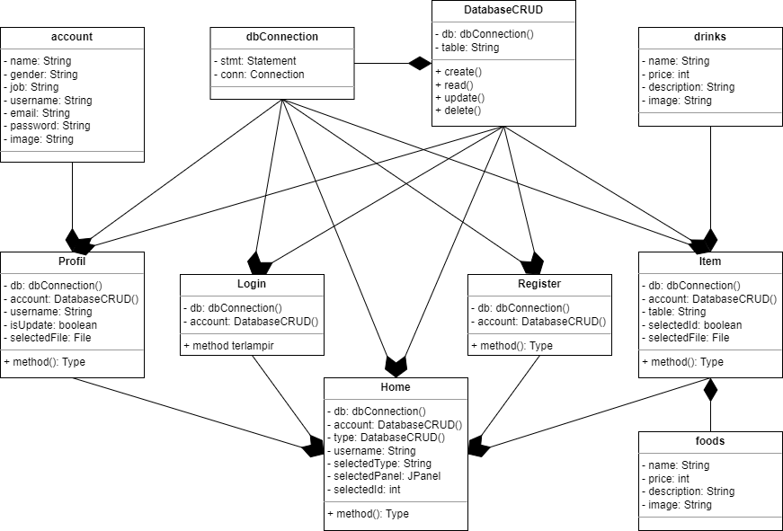
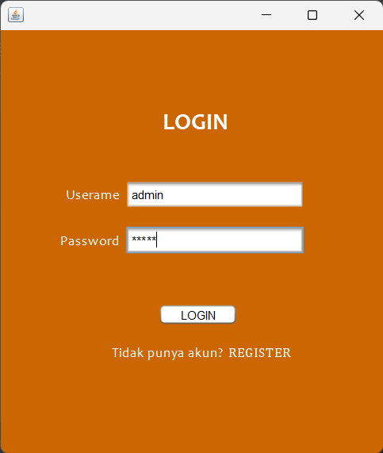
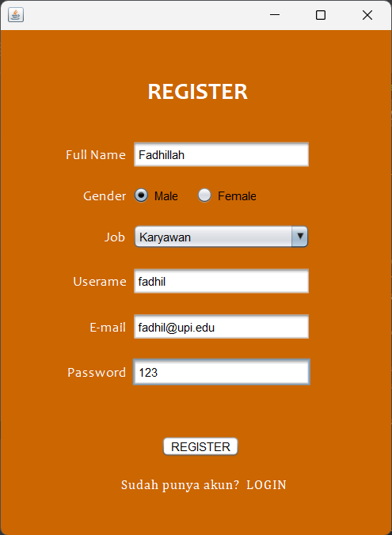
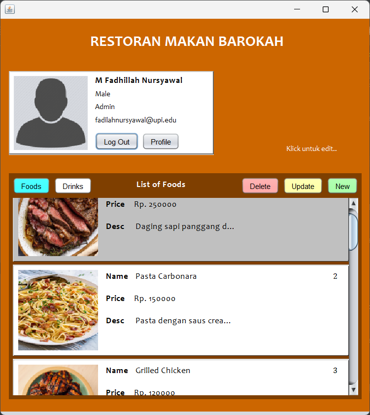
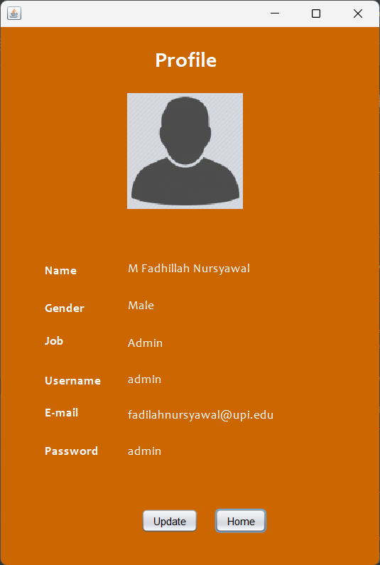
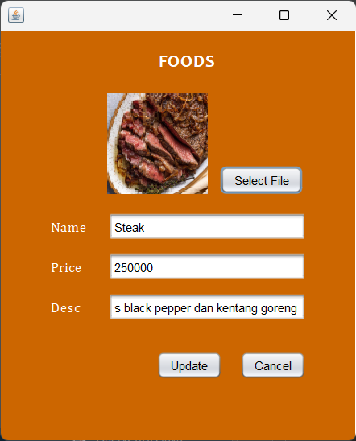

# TP2DPBO2023
Saya Muhammad Fadhillah Nursyawal NIM 2107135 mengerjakan soal TP 2
dalam mata kuliah Desain Pemrograman Berorientasi Objek 
untuk keberkahanNya maka saya tidak melakukan kecurangan seperti yang telah dispesifikasikan. Aamiin.

---

## Task Solved
dibuat untuk memenuhi spesifikasi soal yang sudah ditentukan, untuk selebihnya akan dijelaskan pada bagian desaiin program.

- Program bebas, kecuali program Mahasiswa dan Book Author => Program tentang inventory makanan dan minuman yang akan dijual pada sebuah restoran, terdapat fitur profil juga
- Terdapat proses Create, Read, Update, dan Delete data => 
    - Create => pada tombol new, pada register
    - Read => pada list card, pada profile
    - Update => pada card saat ditekan, pada profile
    - Delete => pada card saat ditekan
- Terdapat proses Autentikasi (Login, Register) => register dapat dilakukan pada tulisan "REGISTER"
- Menggunakan minimal 2 tabel pada database => table yang digunakan: account, foods, dan drinks
- Harus terdapat minimal 1 properti gambar pada class yang dibuat (gambar akan ditampilkan pada UI) => setiap tabel terdapat property gambar
- Terdapat pergantian screen pada UI => saat login, REGISTER, profile, new, update 
- Terdapat button navigasi untuk beralih screen => button logout, profile, foods, drinks
- List data ditampilkan menggunakan card (JPanel) => done.

## Desain Program
Program dibuat dalam tema tentang inventory makanan dan minuman yang akan dijual pada sebuah restoran.
### fitur
- login and register
- profile => + image
    - log out
    - CRU (Create, Read, Update)
- Items (Foods and Drinks) => + image
    - CRUD (Create, Read, Update, Delete)

### UML

- DatabaseCRUD `composite` dbConnection
- Login `composite` DatabaseCRUD, dbConnection
- Register `composite` DatabaseCRUD, dbConnection
- Profil `composite` account, DatabaseCRUD, dbConnection
- Item `composite` foods, drinks, DatabaseCRUD, dbConnection
- Home `composite` DatabaseCRUD, dbConnection, Profil, Login, Register, Items

## Penjelasan Alur
- LOGIN  
Saat program dijalankan sistem akan menampilkan halaman login, kita harus memasukan username dan password yang sudah dibuat, jika belum maka dapat menekan label REGISTER untuk membuat akun terlebih dahulu. 
- REGISTER  
Dalam halaman register kita harus melengkapi form untuk mendaftar, setelah semuanya terisi lalu menekan tombol register maka data akan otomatis disimpan dalam database dan anda dapat login kembali.
- HOME  
Setelah login sistem akan menampilkan home yaitu halaman utama pada program ini. Home akan menampilkan profile dan list dari items makanan dan minuman yang dapat dilihat dengan menekan tombol foods dan drinks. kita juga dapat membuat, merubah, dan menghapus item pada jScrollPanel. Jika ingin mengubah atau menghapus, user dapat menekan/memilih card pada list jScrollPanel lalu akan muncul tombol Update dan Delete
- UPDATE  
Jika menekan tombol update sistem akan menampilkan panel untuk mengupdate data
- DELETE  
Jika menekan tombol delete sistem akan menghapus data otomatis
- CREATE  
jika ingin menambahkan item baru, tekan tombol new, sistem akan menampilkan pilihan mau foods atau drinks. setelah dipilih sistem akan mengalihkan pada halaman untuk mengisi item yang akan kita isi.
- PROFILE  
User juga dapat melihat profile user dengan menekan card profil, setelah itu sistem akan menampilkan frame profil untuk menampilkan profile. user juga dapat mengedit data account.
jika sudah maka user dapat log out dengan menekan tombol log out

## Dokumentasi

